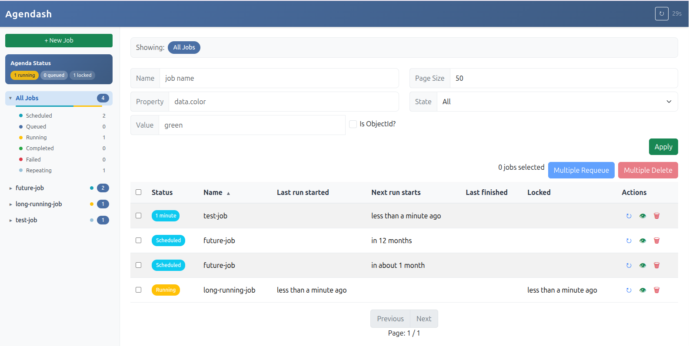
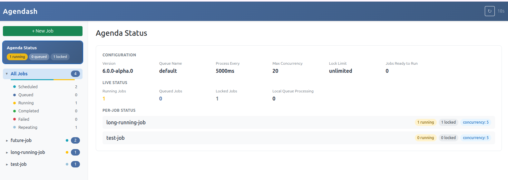

# Agendash

A modern dashboard for [Agenda](https://github.com/agenda/agenda) job scheduler.





## Installation

```bash
npm install agendash agenda @agendajs/mongo-backend
```

## Quick Start

### Express

```typescript
import express from 'express';
import { Agenda } from 'agenda';
import { MongoBackend } from '@agendajs/mongo-backend';
import { expressMiddleware } from 'agendash';

const app = express();
const agenda = new Agenda({
  backend: new MongoBackend({ address: 'mongodb://localhost:27017/agenda' })
});

// Mount agendash at /dash
app.use('/dash', expressMiddleware(agenda));

app.listen(3000, () => {
  console.log('Dashboard: http://localhost:3000/dash');
});
```

### Fastify

```typescript
import Fastify from 'fastify';
import { Agenda } from 'agenda';
import { MongoBackend } from '@agendajs/mongo-backend';
import { fastifyPlugin } from 'agendash';

const fastify = Fastify();
const agenda = new Agenda({
  backend: new MongoBackend({ address: 'mongodb://localhost:27017/agenda' })
});

// Register agendash at /dash
fastify.register(fastifyPlugin(agenda), { prefix: '/dash' });

fastify.listen({ port: 3000 }, () => {
  console.log('Dashboard: http://localhost:3000/dash');
});
```

### Koa

```typescript
import Koa from 'koa';
import Router from 'koa-router';
import { Agenda } from 'agenda';
import { MongoBackend } from '@agendajs/mongo-backend';
import { koaMiddleware } from 'agendash';

const app = new Koa();
const agenda = new Agenda({
  backend: new MongoBackend({ address: 'mongodb://localhost:27017/agenda' })
});

// Mount agendash at /dash
const { router, middleware } = koaMiddleware(agenda, '/dash');
app.use(middleware);
app.use(router.routes());
app.use(router.allowedMethods());

app.listen(3000, () => {
  console.log('Dashboard: http://localhost:3000/dash');
});
```

### Hapi

```typescript
import Hapi from '@hapi/hapi';
import { Agenda } from 'agenda';
import { MongoBackend } from '@agendajs/mongo-backend';
import { hapiPlugin } from 'agendash';

const agenda = new Agenda({
  backend: new MongoBackend({ address: 'mongodb://localhost:27017/agenda' })
});

const server = Hapi.server({ port: 3000 });

await server.register({
  plugin: hapiPlugin(agenda),
  options: { basePath: '/dash' }
});

await server.start();
console.log('Dashboard: http://localhost:3000/dash');
```

## Features

- **Job Overview**: View all jobs organized by name with status counts
- **Job States**: See jobs by state (scheduled, queued, running, completed, failed, repeating)
- **Agenda Status**: Live view of running/queued/locked jobs and configuration
- **Filtering**: Filter jobs by name, state, or search within job data
- **Job Management**: Create, requeue, and delete jobs
- **Bulk Operations**: Multi-select jobs for bulk requeue or delete
- **Job Details**: View job data, timestamps, and failure information
- **Auto-refresh**: Dashboard refreshes automatically with countdown indicator
- **Mobile Responsive**: Works on desktop and mobile devices

## Development

To run agendash in development mode with hot reloading:

```bash
# From the agendash package directory
pnpm dev
```

This starts a development server with:
- Vite dev server for frontend hot reloading
- Express API server
- In-memory MongoDB (no external database required)

## License

MIT
